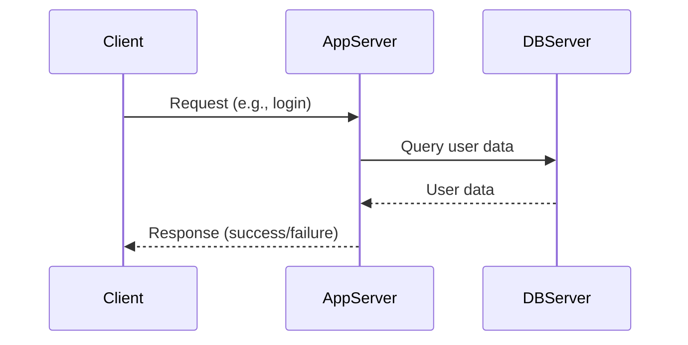
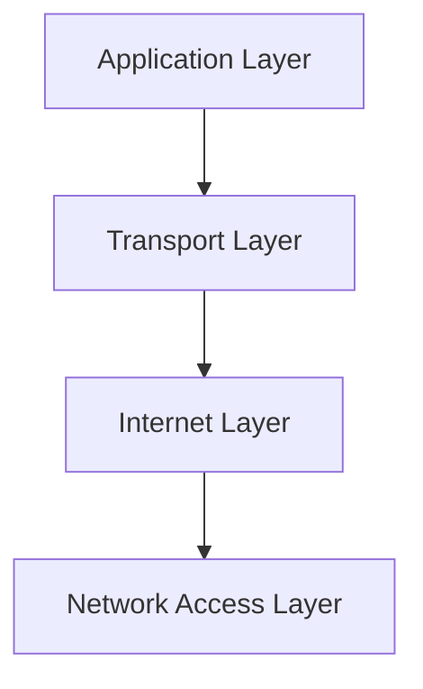
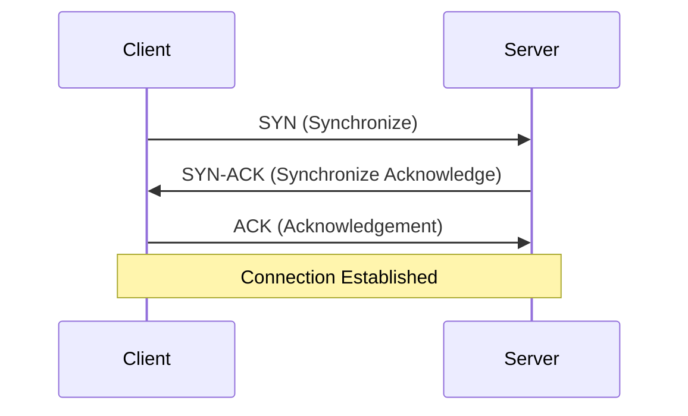
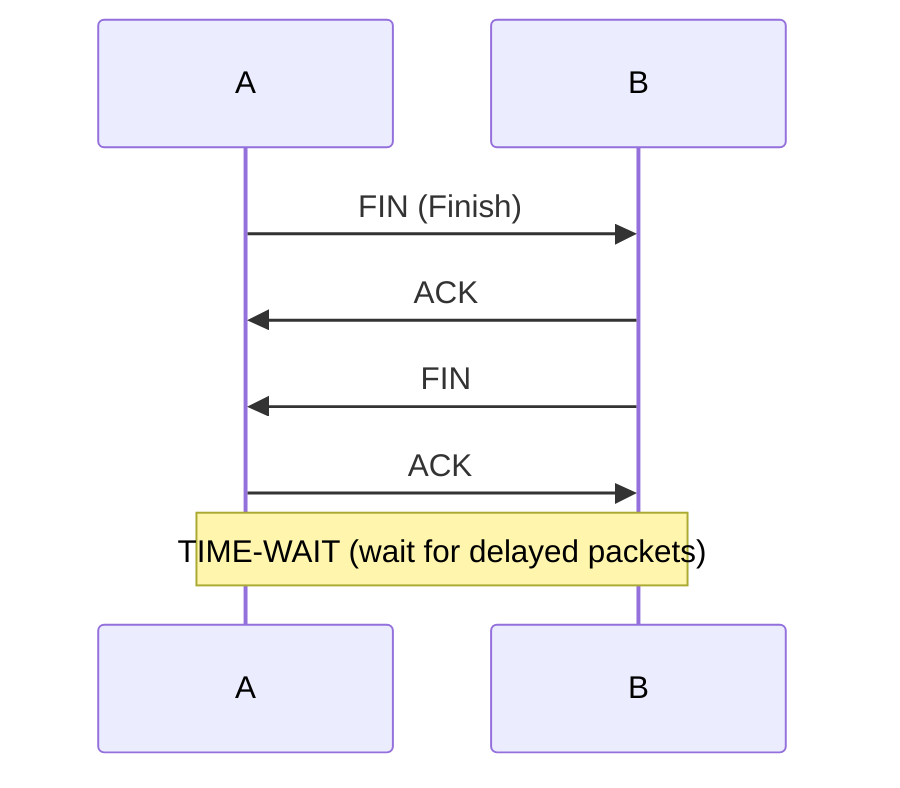
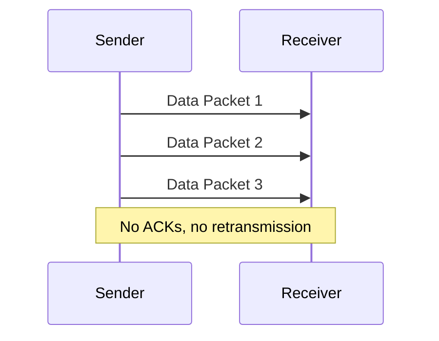
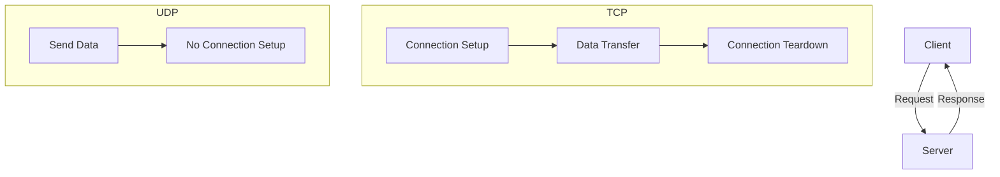

# Networking, TCP, UDP – Study Notes

## 1. Client-Server Architecture & Request-Response Model

- **Client:** Device/software that requests services/data from a server.
- **Server:** Device/software that handles requests and serves responses.

**Examples:**

- **Web Browsing:**  
  Client (browser) requests a webpage → Server retrieves and sends it back.
- **Online Gaming:**  
  Game client interacts with game server for gameplay.

**Can an App Server Act as a Client?**  
Yes!

- **Database Connectivity:** App server acts as a client to DB server.
- **External APIs:** App server requests/receives data from third-party services.

---

## 2. Communication/Networking in High-Level Design (HLD)

- Break complex tasks into modular components.
- Use a hierarchical stack:  
  Each layer serves the one above, relies on the one below.

---

## 3. Network Models

### OSI Model (7 Layers)

- Conceptual, each layer has specific functions.

### TCP/IP Model (4 Layers)

- Practical, focuses on internet communication.

---

## 4. Transport Layer: TCP & UDP

**Function:** Ensures end-to-end data delivery.

| Protocol | Reliability | Ordering | Speed  | Use Cases           |
| -------- | ----------- | -------- | ------ | ------------------- |
| TCP      | Yes         | Yes      | Slower | Web, Email, Banking |
| UDP      | No          | No       | Fast   | Gaming, Streaming   |

---

## 5. Application Layer

- Provides protocols/interfaces for user/app communication.
- **Common Protocols:** HTTP, HTTPS, FTP, SFTP, RTMP, SMTP, POP3, IMAP, DNS, DHCP, SNMP, SSH.

---

## 6. TCP – Connection-Oriented Protocol

- **Connection-Oriented:** Connection established before data transfer, closed after.
- **Reliability:** Guarantees delivery, error-checking.
- **Sequencing:** Packets arrive in order.
- **Drawbacks:** Slower, no broadcasting.
- **Use Cases:** Email, web browsing, military.

### Retransmission of Lost Packets

- Lost packets are retransmitted.
- **Flow Control:** Sliding window prevents sender from overwhelming receiver.

### 3-Way TCP Handshake

### Reliable Data Transfer

- **Segmentation:** Data split into segments with sequence numbers.
- **Acknowledgement:** Receiver sends ACK for each segment.
- **Retransmission:** If no ACK, sender retransmits.

### Graceful Connection Termination (4-Way Handshake)

---

## 7. UDP – Connectionless Protocol

- **Connectionless:** No setup/teardown, less overhead.
- **Unreliable:** No guarantee of delivery/order.
- **No Sequencing:** Application must handle ordering if needed.
- **Faster:** Simple, supports broadcasting.
- **No Retransmission:** Lost packets not resent.
- **Use Cases:** Gaming, video/audio streaming.

---

## 7.1. QUIC – Modern Transport Protocol

- **QUIC (Quick UDP Internet Connections):** A modern transport protocol developed by Google, now standardized by IETF.
- **Built on UDP:** Runs over UDP but adds reliability, multiplexing, and security features similar to (and beyond) TCP.
- **Designed for the modern web:** Powers HTTP/3 and is used by major services (Google, YouTube, Facebook, etc.).

### Key Features

- **Multiplexed Streams:** Multiple streams in a single connection, preventing head-of-line blocking.
- **Built-in Encryption:** Always encrypted (TLS 1.3), no unencrypted mode.
- **Faster Handshakes:** 0-RTT and 1-RTT connection setup, reducing latency.
- **Connection Migration:** Survives IP changes (e.g., switching from Wi-Fi to mobile data).
- **Congestion & Flow Control:** Advanced algorithms for efficient data transfer.
- **Reliability:** Like TCP, but with improved performance for modern applications.

### Use Cases

- **HTTP/3:** The main transport for the latest web protocol.
- **Video/Audio Streaming:** Low latency, high throughput.
- **Mobile Applications:** Seamless connectivity during network changes.

### QUIC vs TCP vs UDP

| Feature      | TCP                        | UDP               | QUIC                         |
| ------------ | -------------------------- | ----------------- | ---------------------------- |
| Connection   | Oriented (3-way handshake) | Connectionless    | Oriented (0/1-RTT handshake) |
| Reliability  | Guaranteed (ACK, retrans)  | Not guaranteed    | Guaranteed (ACK, retrans)    |
| Ordering     | Yes                        | No                | Yes (per stream)             |
| Multiplexing | No (head-of-line blocking) | No                | Yes (no head-of-line block)  |
| Encryption   | Optional (TLS/SSL)         | Optional          | Always (TLS 1.3)             |
| Speed        | Slower                     | Faster            | Fastest (low latency)        |
| Use Cases    | Web, Email, Banking        | Gaming, Streaming | HTTP/3, Streaming, Mobile    |

---

## 8. Summary Table

| Feature     | TCP                        | UDP               |
| ----------- | -------------------------- | ----------------- |
| Connection  | Oriented (3-way handshake) | Connectionless    |
| Reliability | Guaranteed (ACK, retrans)  | Not guaranteed    |
| Ordering    | Yes                        | No                |
| Speed       | Slower                     | Faster            |
| Use Cases   | Web, Email, Banking        | Gaming, Streaming |

---

## 9. Visual Summary

---

**Tip:**

- Use TCP when reliability and order matter.
- Use UDP when speed and low overhead are more important than reliability.

---

Let me know if you want to add more details, examples, or custom diagrams!
