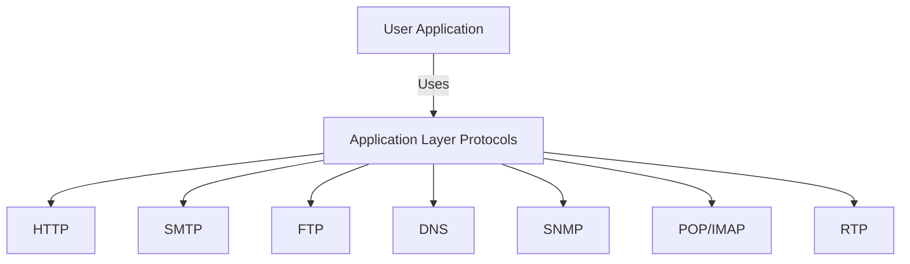
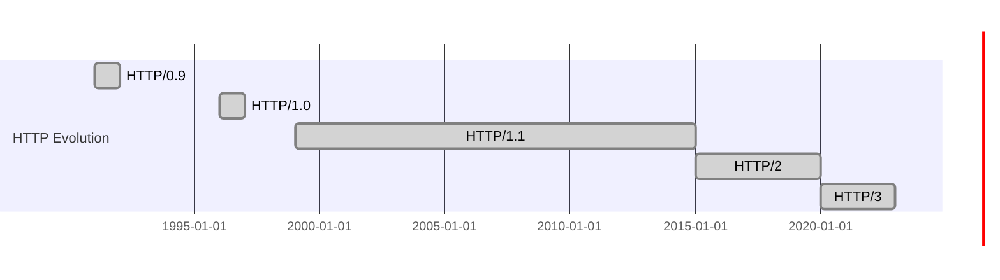
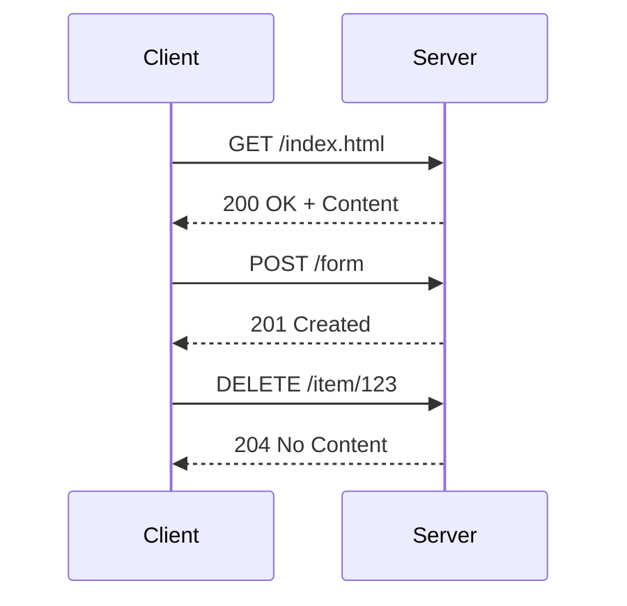
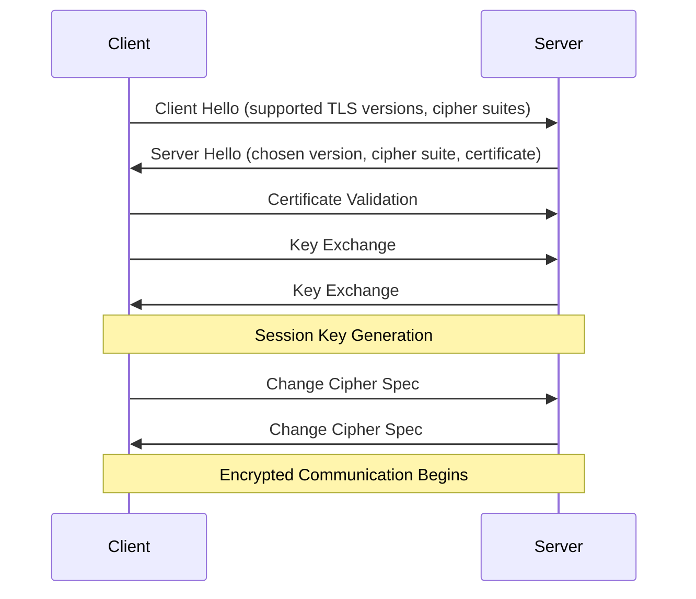
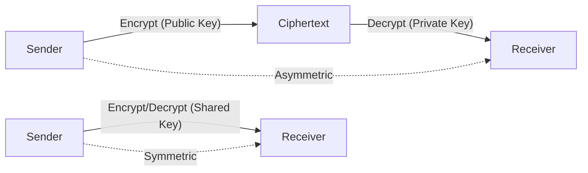

# HTTP – Study Notes

## 1. Application Layer Protocols

The Application Layer provides protocols for communication between user-facing applications and network services.

| Protocol | Full Name                                               | Purpose                                         |
| -------- | ------------------------------------------------------- | ----------------------------------------------- |
| HTTP     | Hypertext Transfer Protocol                             | Web browsing, retrieving webpages and resources |
| SMTP     | Simple Mail Transfer Protocol                           | Sending/receiving emails between mail servers   |
| FTP      | File Transfer Protocol                                  | Uploading/downloading files                     |
| DNS      | Domain Name System                                      | Resolving domain names to IP addresses          |
| SNMP     | Simple Network Management Protocol                      | Managing/monitoring network devices             |
| POP/IMAP | Post Office Protocol / Internet Message Access Protocol | Retrieving emails from mail servers             |
| RTP      | RealTime Transport Protocol                             | Real-time audio/video transmission              |

**Illustration:**

---

## 2. HTTP Versions

HTTP has evolved to improve performance, security, and efficiency.

| Version  | Year | Key Features                                                   |
| -------- | ---- | -------------------------------------------------------------- |
| HTTP/0.9 | 1991 | Simple, only GET, plain text, no status codes                  |
| HTTP/1.0 | 1996 | Headers, status codes, multiple content types                  |
| HTTP/1.1 | 1999 | Persistent connections, chunked transfer, caching, host header |
| HTTP/2   | 2015 | Multiplexing, header compression, binary framing               |
| HTTP/3   | 2020 | Built on QUIC, faster, reduced latency                         |

**Timeline:**

**HTTP/3 and QUIC:**

- HTTP/3 uses QUIC (Quick UDP Internet Connections) for faster, more reliable connections with lower latency.

---

## 3. HTTP Methods

HTTP defines several methods for client-server communication:

| Method  | Purpose                     | Idempotent |
| ------- | --------------------------- | ---------- |
| GET     | Retrieve data               | Yes        |
| POST    | Submit data/create resource | No         |
| PUT     | Update resource             | Yes        |
| DELETE  | Remove resource             | Yes        |
| PATCH   | Partial update              | No         |
| HEAD    | Retrieve headers only       | Yes        |
| OPTIONS | Query supported methods     | Yes        |
| TRACE   | Diagnostic loopback         | Yes        |
| CONNECT | Establish tunnel            | Yes        |

**Illustration:**

---

## 4. HTTPS – Secure HTTP

HTTPS encrypts HTTP traffic using SSL/TLS to ensure confidentiality and integrity.

**SSL/TLS Handshake Process:**

---

## 5. Encryption Types

| Type       | Description                                                                                                                             | Use Case                     |
| ---------- | --------------------------------------------------------------------------------------------------------------------------------------- | ---------------------------- |
| Symmetric  | Same key for encryption/decryption (e.g., AES, DES). Fast, but key must be shared securely.                                             | Bulk data encryption         |
| Asymmetric | Public key for encryption, private key for decryption (e.g., RSA, ECC). Slower, but enables secure key exchange and digital signatures. | Key exchange, authentication |

**Illustration:**

---

**Summary:**

- HTTP is the foundation of web communication, evolving for speed and security.
- HTTPS uses encryption to protect data.
- Modern protocols (HTTP/2, HTTP/3) and encryption methods ensure efficient, secure communication.
