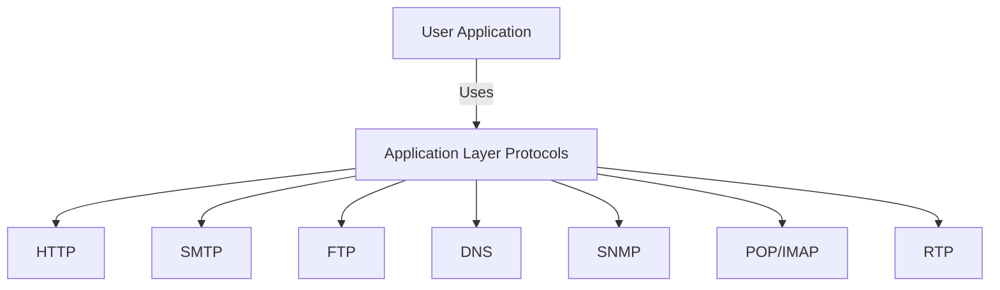
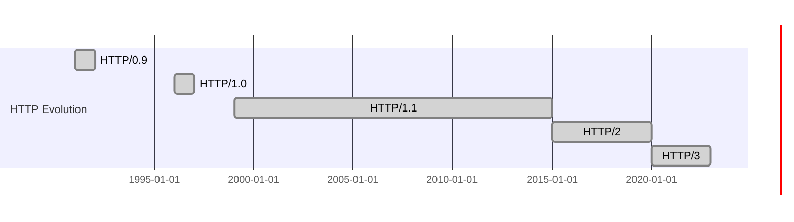
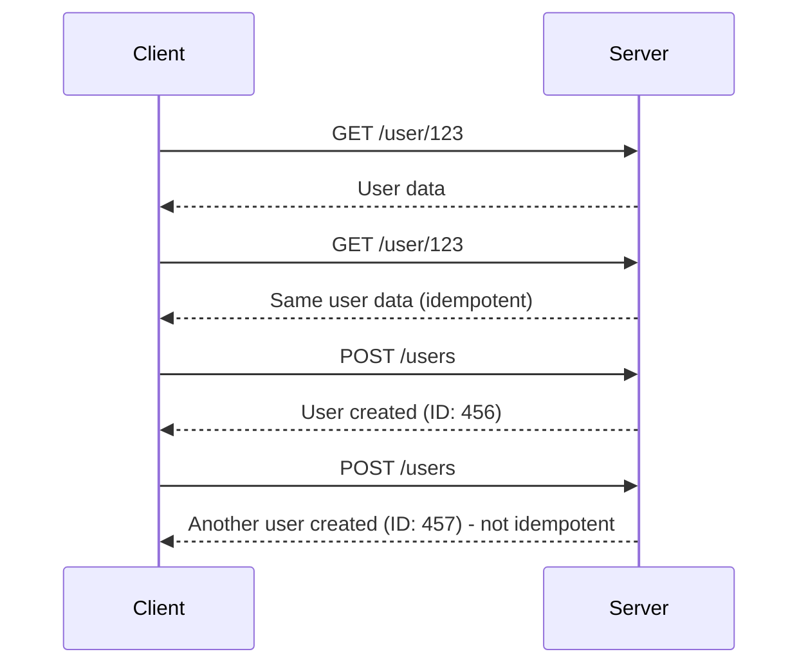
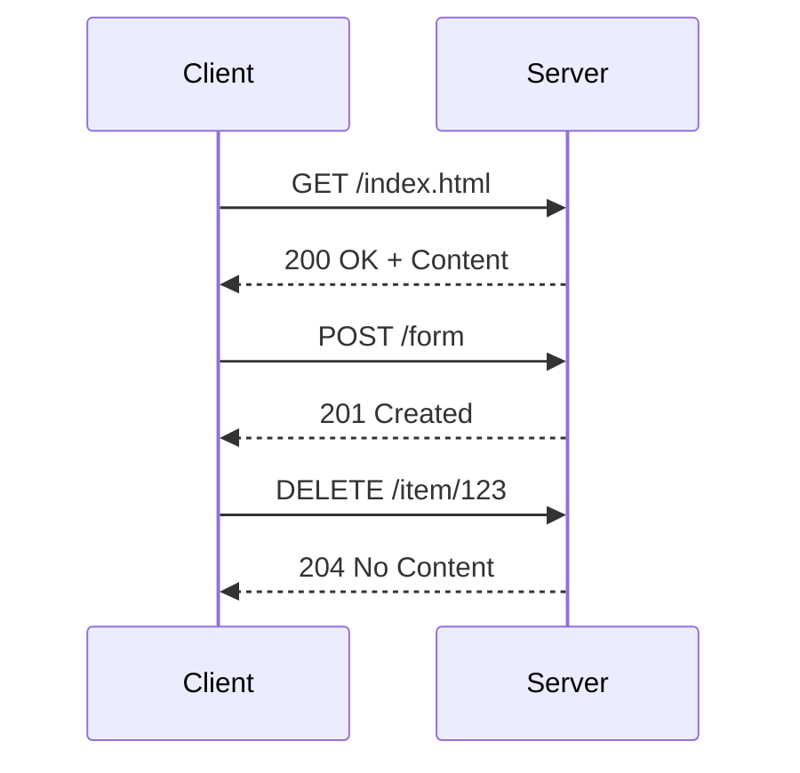
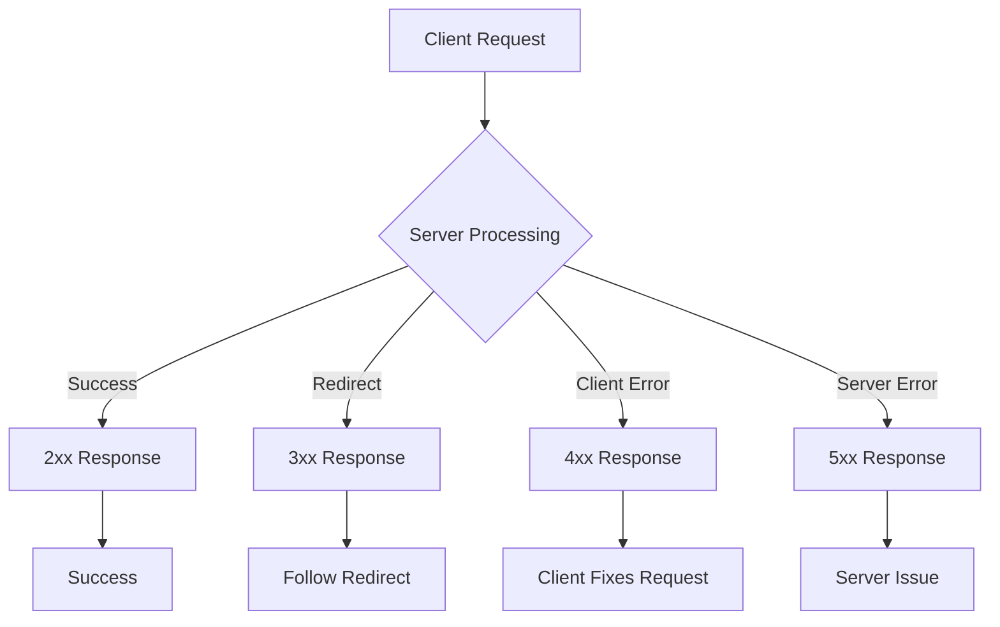
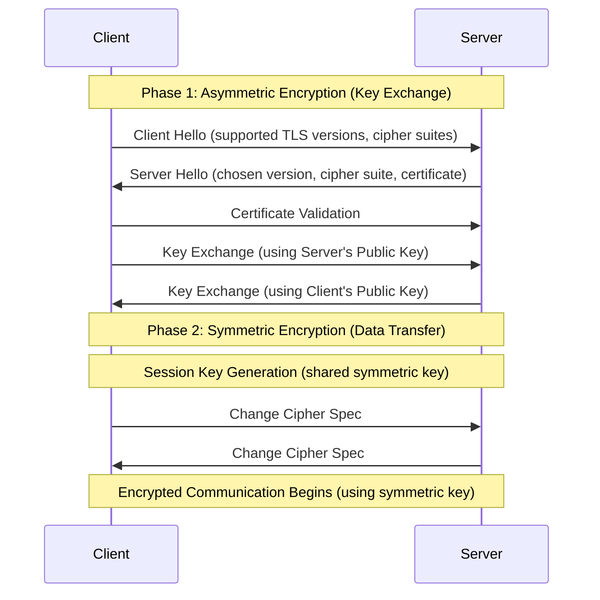
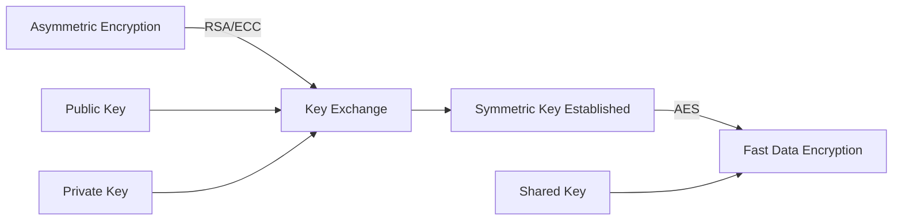
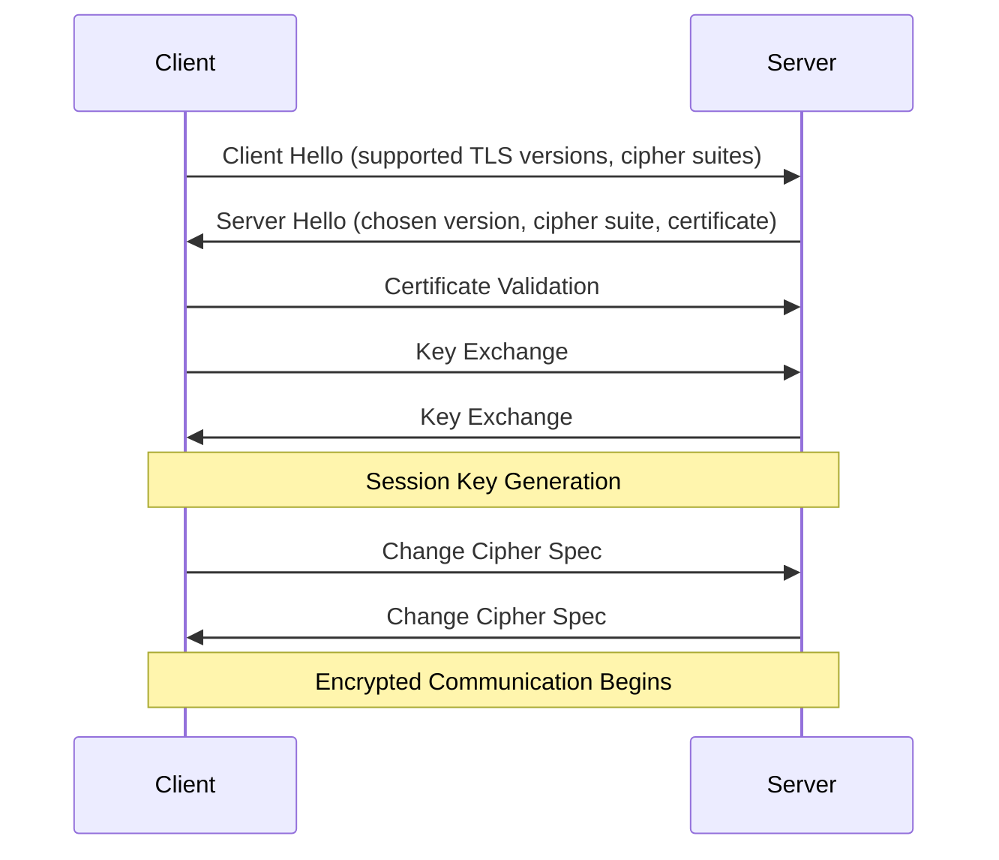
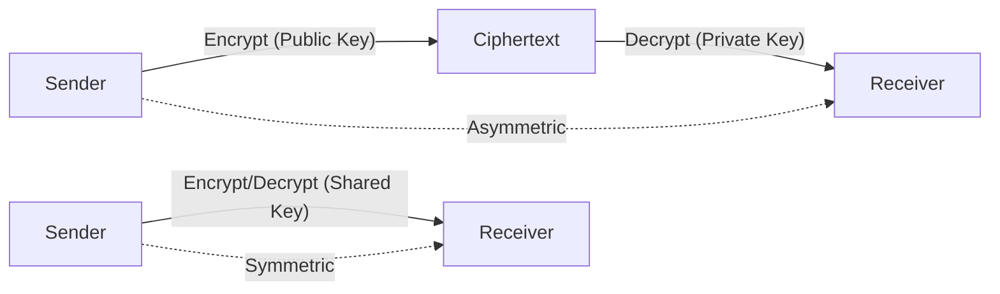
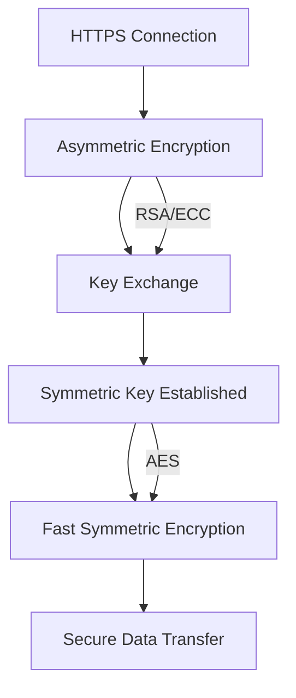

# HTTP – Study Notes

## 1. Application Layer Protocols

The Application Layer provides protocols for communication between user-facing applications and network services.

| Protocol | Full Name                                               | Purpose                                         |
| -------- | ------------------------------------------------------- | ----------------------------------------------- |
| HTTP     | Hypertext Transfer Protocol                             | Web browsing, retrieving webpages and resources |
| SMTP     | Simple Mail Transfer Protocol                           | Sending/receiving emails between mail servers   |
| FTP      | File Transfer Protocol                                  | Uploading/downloading files                     |
| DNS      | Domain Name System                                      | Resolving domain names to IP addresses          |
| SNMP     | Simple Network Management Protocol                      | Managing/monitoring network devices             |
| POP/IMAP | Post Office Protocol / Internet Message Access Protocol | Retrieving emails from mail servers             |
| RTP      | RealTime Transport Protocol                             | Real-time audio/video transmission              |

**Illustration:**



---

## 2. HTTP Versions

HTTP has evolved to improve performance, security, and efficiency.

| Version  | Year | Key Features                                                   |
| -------- | ---- | -------------------------------------------------------------- |
| HTTP/0.9 | 1991 | Simple, only GET, plain text, no status codes                  |
| HTTP/1.0 | 1996 | Headers, status codes, multiple content types                  |
| HTTP/1.1 | 1999 | Persistent connections, chunked transfer, caching, host header |
| HTTP/2   | 2015 | Multiplexing, header compression, binary framing               |
| HTTP/3   | 2020 | Built on QUIC, faster, reduced latency                         |

**Timeline:**



**HTTP/3 and QUIC:**

- HTTP/3 uses QUIC (Quick UDP Internet Connections) for faster, more reliable connections with lower latency.

---

## 3. HTTP Methods

HTTP defines several methods for client-server communication:

| Method  | Purpose                     | Idempotent |
| ------- | --------------------------- | ---------- |
| GET     | Retrieve data               | Yes        |
| POST    | Submit data/create resource | No         |
| PUT     | Update resource             | Yes        |
| DELETE  | Remove resource             | Yes        |
| PATCH   | Partial update              | No         |
| HEAD    | Retrieve headers only       | Yes        |
| OPTIONS | Query supported methods     | Yes        |
| TRACE   | Diagnostic loopback         | Yes        |
| CONNECT | Establish tunnel            | Yes        |

### GET Method

- **Purpose:** Retrieve data from the server
- **Characteristics:**
  - Safe (no side effects on server)
  - Idempotent (same result every time)
  - Cacheable
  - Parameters sent in URL query string
- **Example:** `GET /users?id=123&name=john`
- **Use Cases:** Fetching web pages, API data retrieval, search queries

### POST Method

- **Purpose:** Submit data to create new resources or process form data
- **Characteristics:**
  - Not safe (can modify server state)
  - Not idempotent (may create multiple resources)
  - Not cacheable
  - Data sent in request body
- **Example:** `POST /users` with JSON body `{"name": "john", "email": "john@example.com"}`
- **Use Cases:** Form submissions, file uploads, API data creation

### Idempotency

**Definition:** An HTTP method is idempotent if making multiple identical requests has the same effect as making a single request.

**Idempotent Methods:**

- **GET:** Always returns the same data
- **PUT:** Replaces entire resource (same result each time)
- **DELETE:** Removes resource (same result each time)
- **HEAD:** Returns same headers
- **OPTIONS:** Returns same supported methods

**Non-Idempotent Methods:**

- **POST:** May create multiple resources
- **PATCH:** May have different effects each time

**Example:**



**Illustration:**



---

## 3.1. HTTP Status Codes

HTTP status codes indicate the result of a request:

### 2xx Success Codes

| Code | Name       | Description                             |
| ---- | ---------- | --------------------------------------- |
| 200  | OK         | Request succeeded                       |
| 201  | Created    | Resource created successfully           |
| 202  | Accepted   | Request accepted for processing         |
| 204  | No Content | Request succeeded, no content to return |

### 3xx Redirection Codes

| Code | Name               | Description                           |
| ---- | ------------------ | ------------------------------------- |
| 301  | Moved Permanently  | Resource moved permanently            |
| 302  | Found              | Temporary redirect                    |
| 304  | Not Modified       | Resource not changed (cached)         |
| 307  | Temporary Redirect | Temporary redirect (method preserved) |

### 4xx Client Error Codes

| Code | Name              | Description                          |
| ---- | ----------------- | ------------------------------------ |
| 400  | Bad Request       | Invalid request syntax               |
| 401  | Unauthorized      | Authentication required              |
| 403  | Forbidden         | Server refuses to authorize          |
| 404  | Not Found         | Resource not found                   |
| 409  | Conflict          | Request conflicts with current state |
| 429  | Too Many Requests | Rate limit exceeded                  |

### 5xx Server Error Codes

| Code | Name                  | Description                           |
| ---- | --------------------- | ------------------------------------- |
| 500  | Internal Server Error | Server encountered an error           |
| 502  | Bad Gateway           | Invalid response from upstream server |
| 503  | Service Unavailable   | Server temporarily unavailable        |
| 504  | Gateway Timeout       | Upstream server timeout               |

**Status Code Flow:**



---

## 3.2. HTTP Request/Response Structure

### HTTP Request Structure

```
GET /api/users HTTP/1.1
Host: api.example.com
User-Agent: Mozilla/5.0
Accept: application/json
Authorization: Bearer token123

[Request Body - for POST/PUT]
```

**Components:**

- **Request Line:** Method + URI + HTTP Version
- **Headers:** Key-value pairs with metadata
- **Body:** Data (for POST/PUT requests)

### HTTP Response Structure

```
HTTP/1.1 200 OK
Content-Type: application/json
Content-Length: 1234
Cache-Control: no-cache

[Response Body]
```

**Components:**

- **Status Line:** HTTP Version + Status Code + Reason
- **Headers:** Response metadata
- **Body:** Response data

---

## 4. HTTPS – Secure HTTP

HTTPS encrypts HTTP traffic using SSL/TLS to ensure confidentiality and integrity.

### SSL/TLS Handshake Process

**Step-by-Step Process:**

1. **Client Hello:** Client sends supported TLS versions and cipher suites
2. **Server Hello:** Server selects TLS version, cipher suite, and sends certificate
3. **Certificate Validation:** Client verifies server's certificate
4. **Key Exchange:** Both parties exchange keys to establish secure session
5. **Session Key Generation:** Both generate symmetric session keys
6. **Change Cipher Spec:** Both switch to encrypted communication

**Why Asymmetric + Symmetric?**

- **Asymmetric Encryption (RSA/ECC):** Used for initial key exchange
  - Secure but slow for large data
  - Perfect for exchanging small amounts of data (keys)
- **Symmetric Encryption (AES):** Used for actual data transfer
  - Fast and efficient for large amounts of data
  - Session key established via asymmetric encryption

**Process Flow:**



**Encryption Flow:**



**SSL/TLS Handshake Process:**



---

## 5. Encryption Types

| Type       | Description                                                                                                                             | Use Case                     |
| ---------- | --------------------------------------------------------------------------------------------------------------------------------------- | ---------------------------- |
| Symmetric  | Same key for encryption/decryption (e.g., AES, DES). Fast, but key must be shared securely.                                             | Bulk data encryption         |
| Asymmetric | Public key for encryption, private key for decryption (e.g., RSA, ECC). Slower, but enables secure key exchange and digital signatures. | Key exchange, authentication |

**Illustration:**



**Hybrid Approach in HTTPS:**



---

**Summary:**

- HTTP is the foundation of web communication, evolving for speed and security.
- HTTPS uses encryption to protect data.
- Modern protocols (HTTP/2, HTTP/3) and encryption methods ensure efficient, secure communication.
