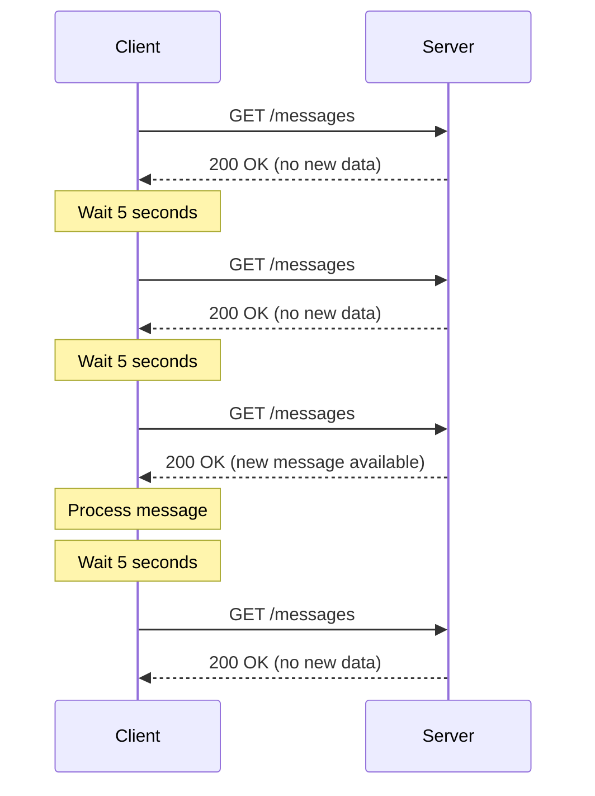
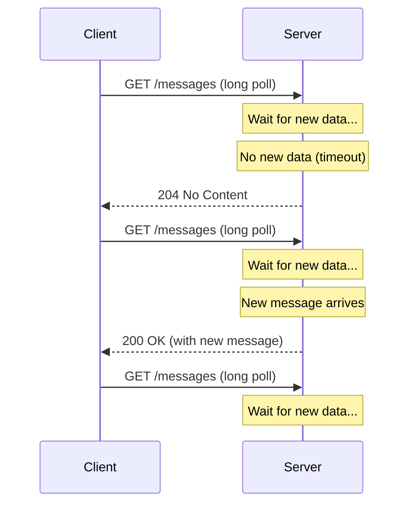
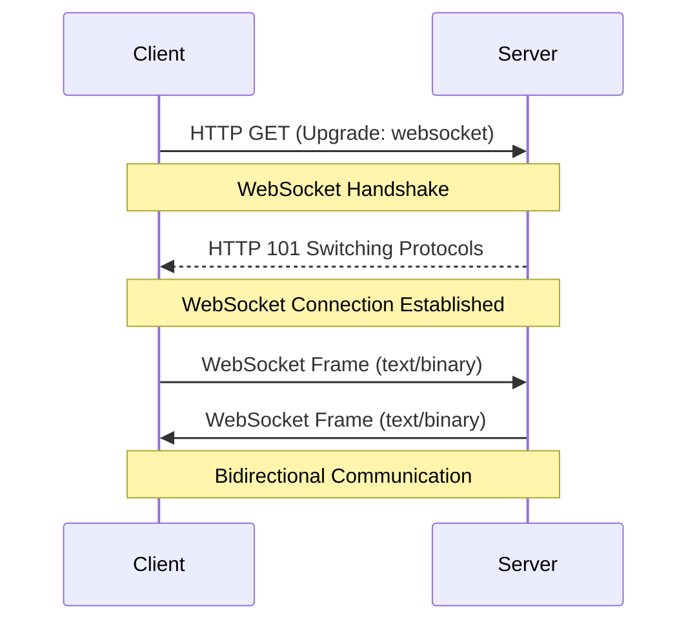
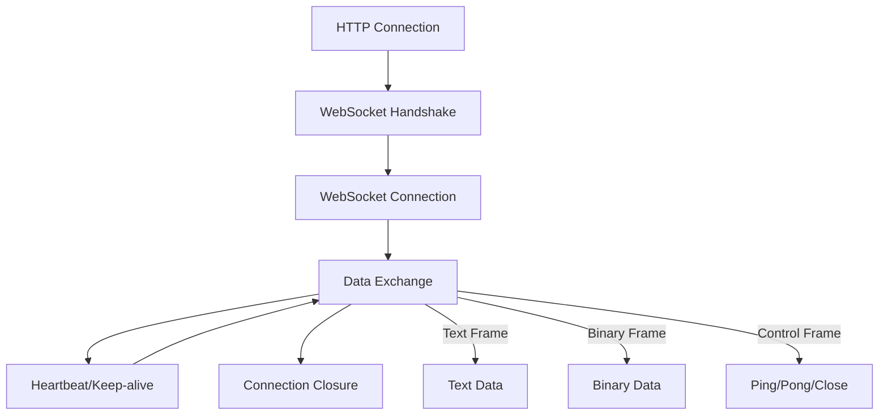
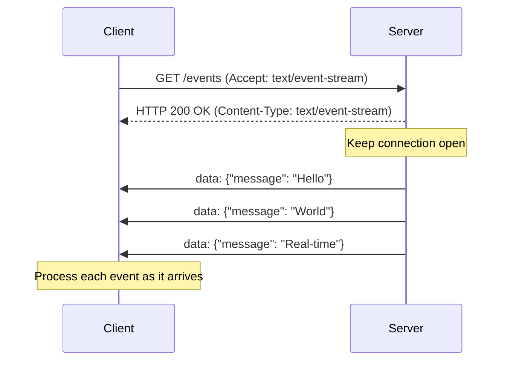
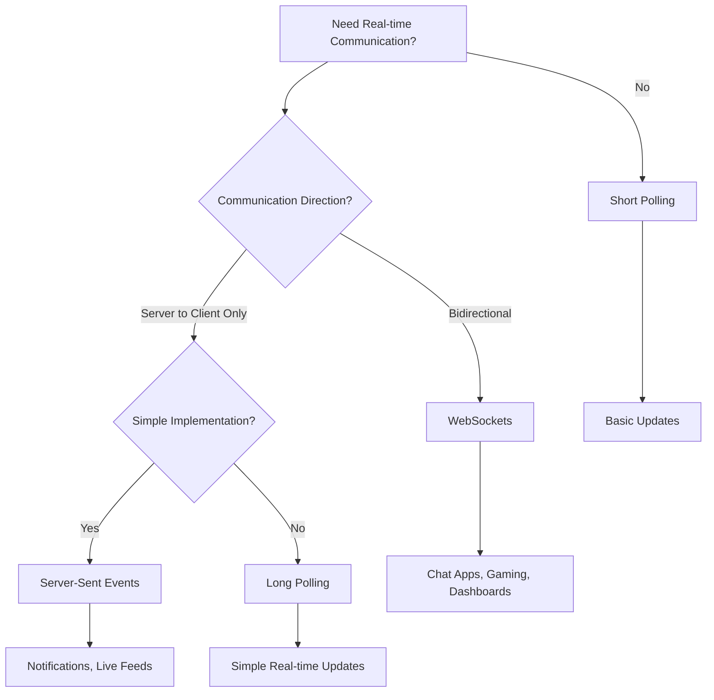

# Real-Time Communication – Study Notes

## 1. Introduction to Real-Time Communication

**Real-Time Communication:** A method of data exchange where information is transmitted and received instantly or with minimal delay between systems.

**Problem Statement:** How does Client A send a message to Client B through an App Server?

**Solution Approaches:**

1. **Polling:** Client B repeatedly asks the server for new messages
2. **WebSockets:** Full-duplex, bidirectional communication
3. **Server-Sent Events (SSE):** Server pushes data to client

---

## 2. Polling

**Definition:** A technique where the client repeatedly requests data from the server at regular intervals to check for updates.

### 2.1 Short Polling

**Definition:** Client sends HTTP GET requests to the server at fixed intervals (e.g., every 5 seconds).

**Process:**

1. Client sends HTTP GET request
2. Server responds immediately with data or empty response
3. Client waits for fixed interval
4. Client sends another request

**Example Code:**

```javascript
function fetchData() {
  // Make HTTP GET request to server
  fetch("/api/messages").then((response) => {
    if (response.status === 200) {
      // Process response data
      console.log("New messages received");
    } else {
      // Handle error
      console.error("Error fetching data");
    }
  });
}

function initiateShortPolling() {
  // Loop forever
  setInterval(() => {
    fetchData();
  }, 5000); // Wait for 5 seconds
}
```

**Visual Flow:**



**Drawbacks:**

- ❌ Inefficient resource use
- ❌ Frequent unnecessary requests
- ❌ High latency and server load
- ❌ High network traffic
- ❌ Not truly real-time (depends on polling interval)

---

### 2.2 Long Polling

**Definition:** Client sends a request and server keeps it open until new data is available or timeout occurs.

**Process:**

1. Client sends HTTP GET request
2. Server holds request until new data arrives or timeout
3. Server responds with data when available
4. Client immediately sends new request

**Example Code:**

```javascript
function fetchData() {
  // Make HTTP GET request to server
  fetch("/api/messages/long-poll").then((response) => {
    if (response.status === 200) {
      // Process response data
      console.log("New messages received");
      fetchData(); // Immediately initiate next request
    } else if (response.status === 204) {
      // No new data, retry
      fetchData();
    } else {
      // Handle error
      console.error("Error fetching data");
    }
  });
}

function initiateLongPolling() {
  fetchData();
}
```

**Visual Flow:**



**Advantages:**

- ✅ Near real-time communication
- ✅ Reduces unnecessary traffic compared to short polling
- ✅ Lower latency than short polling

**Limitations:**

- ❌ Still requires client-initiated requests
- ❌ Higher server-side memory use for open connections
- ❌ Connection timeouts can cause issues

---

## 3. WebSockets

**Definition:** A protocol that enables full-duplex, bidirectional communication over a persistent TCP connection.

**Key Terms:**

- **Full-duplex:** Both directions can communicate simultaneously
- **Bidirectional:** Data flows in both directions
- **Persistent connection:** Connection stays open until explicitly closed

### 3.1 WebSocket Handshake Process

**Step 1: Client Handshake Request**

```
GET /websocket HTTP/1.1
Host: server.example.com
Upgrade: websocket
Connection: Upgrade
Sec-WebSocket-Key: dGhlIHNhbXBsZSBub25jZQ==
Sec-WebSocket-Version: 13
```

**Step 2: Server Response**

```
HTTP/1.1 101 Switching Protocols
Upgrade: websocket
Connection: Upgrade
Sec-WebSocket-Accept: s3pPLMBiTxaQ9kYGzzhZRbK+xOo=
```

**Visual Handshake:**



### 3.2 WebSocket Communication Flow

**Data Transmission:**

- Data sent as frames (header + payload)
- Supports text or binary formats
- Heartbeat/keep-alive prevents connection closure

**Connection Lifecycle:**



**Example Implementation:**

```javascript
// Client-side WebSocket
const ws = new WebSocket("ws://server.example.com/websocket");

ws.onopen = function () {
  console.log("WebSocket connection established");
  ws.send("Hello Server!");
};

ws.onmessage = function (event) {
  console.log("Received:", event.data);
};

ws.onclose = function () {
  console.log("WebSocket connection closed");
};

// Server-side (Node.js with ws library)
const WebSocket = require("ws");
const wss = new WebSocket.Server({ port: 8080 });

wss.on("connection", function connection(ws) {
  ws.on("message", function incoming(message) {
    console.log("Received:", message);
    ws.send("Message received!");
  });
});
```

**Advantages:**

- ✅ Persistent connection minimizes latency
- ✅ Reduces network traffic (no frequent reconnections)
- ✅ Scalable and efficient for real-time use cases
- ✅ Full-duplex communication
- ✅ Low overhead after initial handshake

**Use Cases:**

- Chat applications
- Collaborative tools
- Real-time dashboards
- Gaming
- Live streaming

---

## 4. Server-Sent Events (SSE)

**Definition:** A unidirectional protocol where the server pushes continuous event streams to the client over a single HTTP connection.

**Key Terms:**

- **Unidirectional:** Data flows only from server to client
- **Event stream:** Continuous flow of events
- **HTTP-based:** Uses standard HTTP protocol

### 4.1 SSE Connection Process

**Step 1: Connection Establishment**

```
GET /events HTTP/1.1
Host: server.example.com
Accept: text/event-stream
Cache-Control: no-cache
```

**Step 2: Server Response**

```
HTTP/1.1 200 OK
Content-Type: text/event-stream
Cache-Control: no-cache
Connection: keep-alive

data: {"message": "Hello World"}
event: message
id: 1

data: {"message": "Another message"}
event: message
id: 2
```

**Visual Flow:**



### 4.2 SSE Event Format

**Event Structure:**

```
event: message
id: 123
data: {"type": "notification", "content": "New message"}

data: Simple message without event type

: This is a comment
```

**Event Types:**

- `data:` - The actual event data
- `event:` - Event type (optional)
- `id:` - Event ID for reconnection
- `:` - Comment (ignored by client)

**Example Implementation:**

```javascript
// Client-side SSE
const eventSource = new EventSource("/events");

eventSource.onopen = function () {
  console.log("SSE connection opened");
};

eventSource.onmessage = function (event) {
  console.log("Received:", event.data);
};

eventSource.addEventListener("notification", function (event) {
  console.log("Notification:", event.data);
});

eventSource.onerror = function (event) {
  console.error("SSE error:", event);
};

// Server-side (Node.js with Express)
app.get("/events", (req, res) => {
  res.writeHead(200, {
    "Content-Type": "text/event-stream",
    "Cache-Control": "no-cache",
    Connection: "keep-alive",
  });

  // Send events
  setInterval(() => {
    res.write(`data: ${JSON.stringify({ time: new Date() })}\n\n`);
  }, 1000);
});
```

**Advantages:**

- ✅ Lightweight and efficient
- ✅ Built on HTTP (no special protocol)
- ✅ Automatic reconnection
- ✅ Ideal for server-to-client updates
- ✅ Simple to implement

**Limitations:**

- ❌ Unidirectional (server-to-client only)
- ❌ Requires reliable server-client connectivity
- ❌ Limited browser support (no IE)
- ❌ No built-in client-to-server communication

**Use Cases:**

- Real-time notifications
- Live stock prices
- Live sports scores
- Social media feeds
- Dashboard updates

---

## 5. Comparison Table

| Feature             | Short Polling   | Long Polling        | WebSockets     | SSE                  |
| ------------------- | --------------- | ------------------- | -------------- | -------------------- |
| **Direction**       | Client → Server | Client → Server     | Bidirectional  | Server → Client      |
| **Connection**      | Stateless       | Persistent          | Persistent     | Persistent           |
| **Latency**         | High            | Medium              | Low            | Low                  |
| **Server Load**     | High            | Medium              | Low            | Low                  |
| **Network Traffic** | High            | Medium              | Low            | Low                  |
| **Implementation**  | Simple          | Medium              | Complex        | Simple               |
| **Browser Support** | Universal       | Universal           | Good           | Good (no IE)         |
| **Use Cases**       | Simple updates  | Chat, notifications | Real-time apps | Notifications, feeds |

---

## 6. Decision Flow



---

**Summary:**

- **Short Polling:** Simple but inefficient for real-time communication
- **Long Polling:** Better than short polling, good for simple real-time needs
- **WebSockets:** Best for bidirectional, complex real-time applications
- **SSE:** Perfect for server-to-client notifications and live feeds

Choose based on your specific requirements for direction, complexity, and real-time needs!
